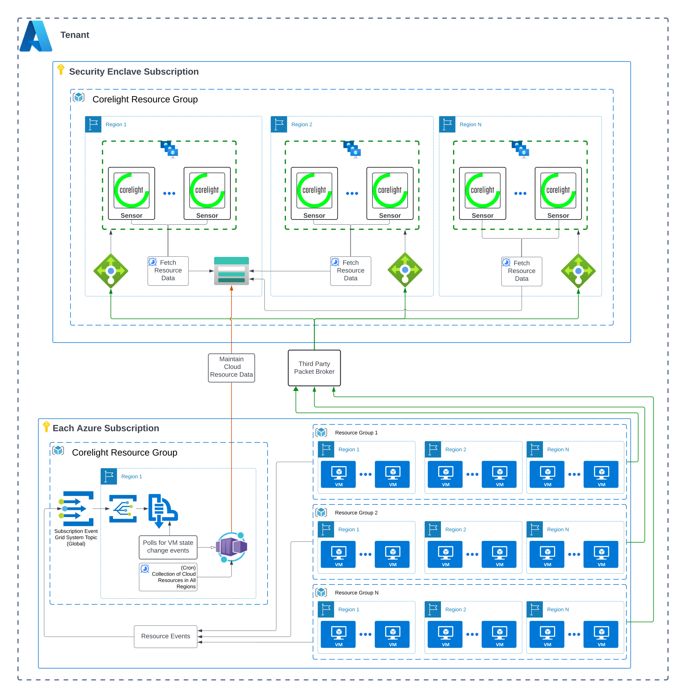

# terraform-azure-enrichment

Terraform for Corelight's Azure Cloud Enrichment.



## Getting Started

Corelight's Azure Cloud Enrichment requires the deployment of an Azure Container App and its
supporting infrastructure to ensure the data in your Corelight cloud sensors are
always up-to-date with the latest state of your cloud resources.

## Usage

```terraform
module "enrichment" {
  source = "github.com/corelight/terraform-azure-enrichment"

  resource_group_name                  = "<Name of the resource group where resources will be deployed>"
  enrichment_storage_account           = "<storage account where enrichment data will be centralized>"
  enrichment_storage_account_container = "<storage account container that will store the cloud resource data>"
  event_grid_system_topic_name         = "<name of the event grid system topic>"
  event_grid_resource_group_name       = "<name of the resource group the event grid system topic is deployed>"
  location                             = "<Azure location where resources will be deployed>"
  subscription_id                      = "the ID (UUID) of the Azure Subscription where resources will be deployed>"

  tags = {
    terraform : true,
    example : true,
    purpose : "Corelight"
  }
}
```

## Deployment

The variables for this module all have default values that can be overwritten
to meet your naming and compliance standards.

Deployment examples can be found [here][].

[here]: https://github.com/corelight/corelight-cloud/tree/main/terraform/azure-cloud-enrichment

## License

The project is licensed under the [MIT][] license.

[MIT]: LICENSE
